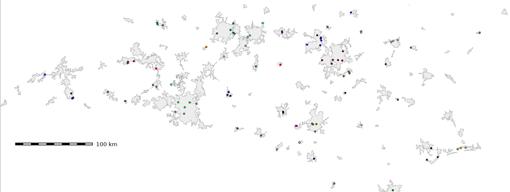

## DESCRIPTION

*v.random.strat.sampling* allows to sample training data in a stratified
way. The number of points is the amount of vector sample points to be
created for each class.

The module can deal with both numeric and text columns.

## EXAMPLE

In this example we sample points from the North Carolina (USA) urban
area map (from North Carolina sample dataset):

```sh
g.region vector=urbanarea -p

# show different attributes
v.db.select urbanarea_sampled_strat column=UA_TYPE -c | sort -u
UA
UC

# sample points randomly but stratified by the two classes from the vector areas
v.random.strat.sampling input=urbanarea column=UA_TYPE output=urbanarea_sampled_strat npoints=50

# new point map: show the attributes of the 50 UA  + 50 UC points
v.db.select urbanarea_sampled_strat

v.info -t urbanarea_sampled_strat
nodes=0
points=100
lines=0
boundaries=0
centroids=0
areas=0
islands=0
primitives=100
map3d=0
```

[](v_random_strat_sampling.png)  
*Figure: 50 sample points per class (stratified sampling on NC urban
area map)*

## SEE ALSO

*[v.random](https://grass.osgeo.org/grass-stable/manuals/v.random.html),
[r.sample.category](r.sample.category.md) (Addon)*

## AUTHORS

Hajar Benelcadi and Anika Bettge (main development),
[mundialis](https://www.mundialis.de/), Germany
